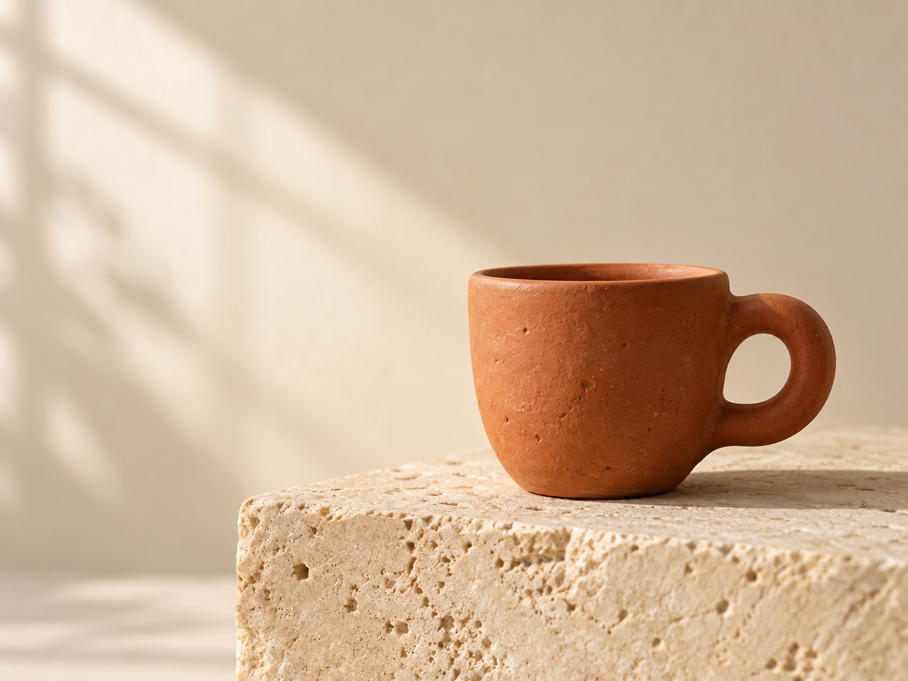
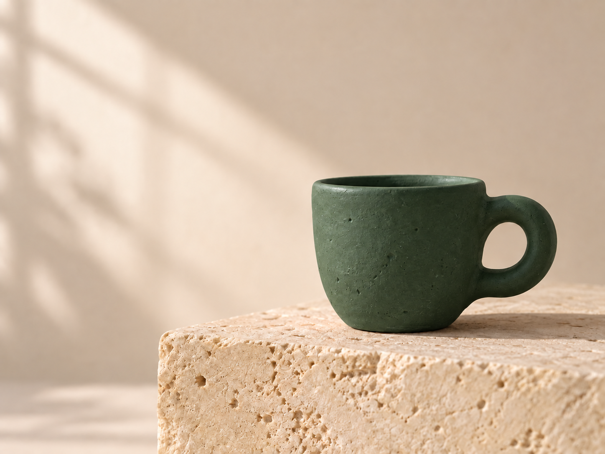

<div align="center">

# Codex Imagegen

### Claude Code 안에서, 마음에 드는 이미지가 나올 때까지.

말로 설명하고, 시안을 고르고, 필요한 부분만 수정하세요. **생성 중에도 코딩은 계속됩니다.**

[](https://skills.sh/JunSeo99/claude-skill-codex-imagegen/codex-imagegen) [](https://github.com/JunSeo99/claude-skill-codex-imagegen/actions) [](LICENSE)

[English](README.md) · **한국어** · [日本語](README.ja.md) · [简体中文](README.zh-CN.md)

</div>

막연한 아이디어를 실제 이미지 파일로 만드는 Claude Code 스킬입니다. **이미 사용 중인 Codex 구독**으로 동작합니다. 이미지 API 키도, 별도의 API 비용도 필요 없습니다.

```bash
npx skills add https://github.com/JunSeo99/claude-skill-codex-imagegen --skill codex-imagegen
```

> “커피 브랜드 이미지 시안 두 개 만들어줘. 이미지 생성하는 동안 페이지 작업도 계속해줘.”

| 01 · 스튜디오 사진 | 02 · 종이 일러스트 | 01 수정 · 녹색 유약 |
|:---:|:---:|:---:|
|  |  |  |
| 따뜻한 빛과 자연스러운 재질 | 선명한 형태와 종이 질감 | “구도는 그대로, 컵 색만 바꿔줘.” |

이 저장소의 실행기로 실제 생성한 결과입니다. [프롬프트와 검증 기록](docs/validation.md)을 공개합니다. Codex가 이미지 모델을 관리하므로, 이 결과를 특정 GPT Image 모델의 출력이라고 표시하지 않습니다.

## 이렇게 요청하세요

| 하고 싶은 일 | 요청 예시 |
|---|---|
| 바로 한 장 만들기 | “이 페이지에 어울리는 히어로 이미지 만들어줘.” |
| 방향부터 잡기 | “뭘 만들지 모르겠어. 짧게 인터뷰해줘.” |
| 여러 시안 비교 | “서로 확실히 다른 방향으로 세 개 보여줘.” |
| 선택한 이미지 수정 | “2번으로 할게. 배경만 짙은 남색으로 바꿔줘.” |
| 투명 배경 | “상품 사진을 투명 PNG로 만들어줘.” |
| 스타일 통일 | “이 이미지와 DESIGN.md를 기준으로 나머지도 맞춰줘.” |
| 생성 중 다른 작업 | “이미지들은 병렬로 만들고, 그동안 UI 마무리해줘.” |

요청이 명확하면 질문 없이 시작합니다. 인터뷰는 필요한 경우에만 진행하고, 이미 만족스러운 결과를 자동으로 다시 만들지 않습니다. 이미지를 수정할 때는 원본을 보존합니다.

## 시작하기

macOS 또는 Linux, Python 3.9+, Claude Code, 로그인된 Codex CLI 0.153.4+가 필요합니다.

```bash
# Codex가 없다면 먼저 설치하고 로그인하세요.
npm install -g @openai/codex
codex login

# 스킬 설치
npx skills add https://github.com/JunSeo99/claude-skill-codex-imagegen --skill codex-imagegen
```

새 Claude Code 세션에서 자연어로 요청하면 됩니다. 원하는 경로가 있으면 `assets/hero.png`처럼 함께 알려주세요. 브랜드 자료나 참고 이미지가 있으면 Claude가 필요한 정보만 반영합니다.

수동 설치는 저장소의 `skill/` 폴더를 `~/.claude/skills/codex-imagegen/`에 복사하면 됩니다. [배포 번들](dist/codex-imagegen.skill)을 압축 해제해도 됩니다. Skills CLI로 설치했다면 `npx skills update`로 업데이트하세요.

## 기다림은 백그라운드에서

이미지 생성 호출 자체는 Codex 응답을 기다립니다. 그 대기는 **분리된 Python 프로세스**가 맡습니다. Claude는 작업 경로를 즉시 받고 다른 요청 작업을 진행할 수 있습니다.

- 기본 동시 생성 2개, 최대 4개. 생성 횟수가 늘어나는 기능은 아닙니다.
- 개별 PNG와 비교용 HTML, 상태 파일, 로그를 로컬에 저장합니다.
- 상태 조회와 갤러리 생성에는 Codex를 호출하지 않습니다.
- 실패해도 완료한 결과는 남습니다. 오류 확인 후 재개하면 완료된 이미지는 건너뜁니다.
- 로컬 프로세스이므로 컴퓨터가 켜져 있어야 합니다. 호스트가 분리된 프로세스를 종료하면 호스트의 백그라운드 작업 기능이 필요할 수 있습니다.

Claude가 명령을 처리하지만, 직접 실행할 수도 있습니다.

```bash
python3 skill/scripts/image_project.py \
  --prompt-file brief.txt --out-dir output/hero-v1 --background

python3 skill/scripts/image_project.py --out-dir output/hero-v1 --status
```

여러 시안은 [JSON 계획 예시](tests/prompts/demo/plan.json)를 `--plan`으로 전달합니다. 각 프롬프트 파일은 `$imagegen`으로 시작합니다. `--dry-run`은 생성 없이 입력을 검사합니다.

## 컨텍스트와 구독 사용량을 아낍니다

Claude가 인터뷰·기획·검수를 맡고, Codex에는 완성된 짧은 이미지 지시문만 전달합니다. 기본 중계 모델은 `gpt-5.6-luna`, 추론 설정은 `none`입니다. 중계 호출에서 일반 코딩 지시문과 스킬 목록을 제외합니다.

로컬 점검에서 **자동 삽입 컨텍스트가 11,133자 → 821자**로 줄었습니다. 이는 전체 토큰이나 비용이 93% 줄었다는 뜻은 아닙니다. 이미지·도구 토큰과 런타임 지시문은 여전히 사용됩니다. [측정 범위](docs/validation.md)를 확인하세요.

## GPT Image 2.5 지원 범위

공식 문서는 [Flare](https://developers.openai.com/api/docs/models/gpt-image-2.5-flare)를 빠른 일상 생성용, [Sunburst](https://developers.openai.com/api/docs/models/gpt-image-2.5-sunburst)를 높은 품질과 정밀 편집용으로 소개합니다. 해당 특성과 편집·투명도 지침을 스킬에 반영했습니다.

**현재 이 구독 경로에서 Flare/Sunburst를 강제 선택할 수는 없습니다.** `--model`은 이미지 모델이 아닌 텍스트 중계 모델 설정입니다. 지원하지 않는 선택 옵션이나 별도 과금 API 우회 경로는 제공하지 않습니다. [조사 기록](docs/model-research.md).

## 확인할 수 있는 품질

Claude는 결과를 열어 구도·문구·제품 형태·원치 않은 변경·경계를 확인합니다. 투명 배경은 실제 PNG 픽셀의 알파를 검사합니다. 원본을 보존하고 비율을 유지해 내보내며, 단순 확대를 네이티브 4K로 표현하지 않습니다.

생성형 편집은 일부 디테일이 달라질 수 있고, 문구는 교정이 필요할 수 있습니다. 파일이 생성됐다는 이유만으로 검수 완료라고 처리하지 않습니다.

[스킬 본문](skill/SKILL.md) · [검증 기록](docs/validation.md) · [보안](SECURITY.md) · [변경 이력](CHANGELOG.md)

잘 나온 프롬프트나 재현 가능한 실패 사례가 있다면 이슈로 공유해주세요. 비공개 정보는 제외해주세요. 이 스킬이 작업에 도움이 됐다면 **Star로 저장하고 다음 업데이트도 받아보세요.**

MIT 라이선스. Anthropic·OpenAI와 별개로 운영되는 독립 프로젝트입니다.
