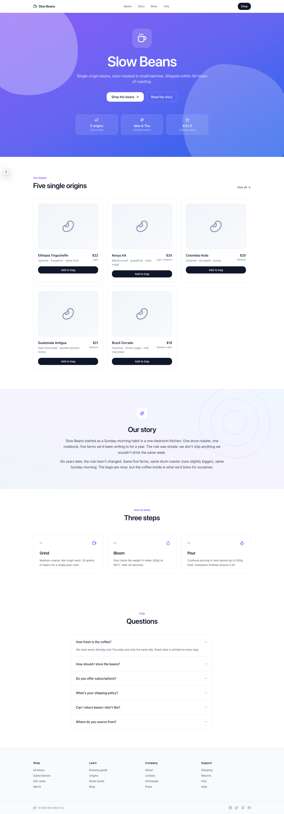
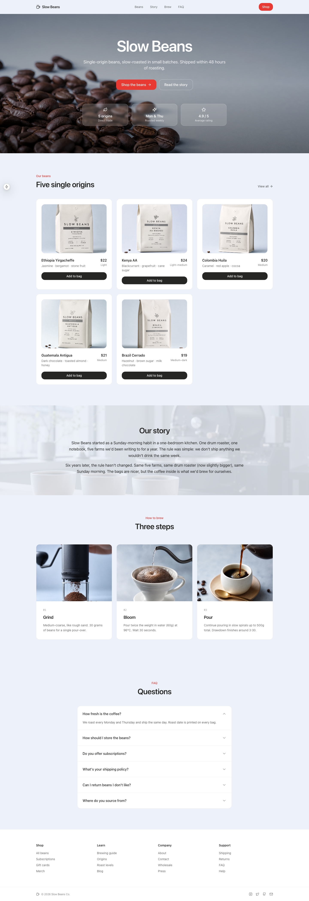

# claude-skill-codex-imagegen
[](https://skills.sh/JunSeo99/claude-skill-codex-imagegen/codex-imagegen)

**Use OpenAI's [gpt-image-2](https://developers.openai.com/api/docs/models/gpt-image-2) — OpenAI's most capable image generation model — from inside [Claude Code](https://docs.claude.com/en/docs/claude-code).**
🌐 **English** · [한국어](./README.ko.md) · [日本語](./README.ja.md) · [简体中文](./README.zh-CN.md)

---

### 📦 What

A Claude Code skill that calls Codex CLI's `$imagegen` (gpt-image-2) on plain natural-language asks — *"generate a hero image"*, *"make a favicon"*, *"insert images that fit the site"* — and lands the result where you actually wanted it. No new slash command to learn. Claude calls it as part of whatever it's already doing.

### 💡 Why

Claude Code has no built-in image model. So most vibe-coded sites either ship without imagery or paste in stock that doesn't match. And generated images from a year ago screamed "AI" louder than the layout did, so people stopped trying. gpt-image-2 finally clears that bar — near-perfect text rendering, consistent lighting, real subject framing — which makes the *image layer* the cheapest way out of the "every AI site looks the same" trap. This skill makes that an in-session step, optionally guided by a `DESIGN.md` you keep at your project root.

### 🚀 Quickstart

```bash
npx skills add https://github.com/JunSeo99/claude-skill-codex-imagegen \
  --skill codex-imagegen
```

Start a new Claude Code session, then ask in natural language:

> *"Generate a 1600×900 hero image for this landing page, save to assets/hero.png."*

Want consistency across an entire site? Drop a `DESIGN.md` at the project root, then:

> *"Using DESIGN.md as the style reference, insert images that fit the site."*

That's it. Full details below.

---

Claude Code does not ship with an image-generation model of its own. This skill closes that gap by teaching Claude Code to call gpt-image-2 through the [OpenAI Codex CLI](https://developers.openai.com/codex/cli)'s built-in `$imagegen` feature — so you can generate icons, banners, OG cards, illustrations, infographics, and photo edits without ever leaving your Claude Code session.

The skill bundles a verified prompting playbook, a CLI reference, a security note, and a sample asset produced during validation.

<p align="center">
  
</p>

<p align="center">
  <em>Sample 1600×900 hero image generated by gpt-image-2 via this skill.</em>
</p>

## Why this skill exists

Claude Code can already drive the Codex CLI, but `$imagegen` has rough edges that Claude misses on its own:

- **Your prompt gets rewritten before it reaches the model.** The Codex agent restructures every prompt into its internal labeled schema (verified via session logs), and *augments* vague prompts with its own taste. This skill writes prompts in that native schema directly, so nothing is lost or invented in translation.
- **Size failures are deterministic, not random.** gpt-image-2 enforces a total-pixel floor of 655,360 (plus multiples-of-16 edges, ≤3:1 ratio) — that's why 256×256 comes back as 1254×1254. The skill generates at valid sizes and downscales on the host.
- **GPT Image 2 supports transparent backgrounds in preview.** The skill asks Codex for a genuinely transparent PNG, then runs a bundled dependency-free pixel validator that requires alpha values from 0 to 255 and, for cutouts, fully transparent corners. See the [official OpenAI image-generation guide](https://developers.openai.com/api/docs/guides/image-generation#customize-image-output).
- **`quality`, masks, and `input_fidelity` are not launcher controls.** The skill keeps the subscription path intentionally small: specify the intended finish in the brief, attach role-labeled references, visually verify, and resize accepted outputs on the host.
- The raw PNG lands under `~/.codex/generated_images/<session-uuid>/` — not where you asked
- "Stunning, cinematic, 8K" keyword prompts produce visibly worse output than structured briefs — the skill enforces a schema-based prompt with concrete art direction
- Passing a user prompt directly inside a shell command creates an injection boundary — the bundled launcher sends prompts over stdin, uses a read-only sandbox, and validates every returned PNG path before the host copies anything

This skill bakes those facts into a **sandboxed split workflow**: Codex generates only; the host validates the generated path and performs file moves and post-processing in its own approved context.

### What people use it for

The tool is general — anything that needs a PNG/JPEG/WebP written to disk fits. In practice the workflows that come up most often:

- **Hero images and background photography** for landing pages and marketing sites
- **OG cards and social previews** generated per page
- **Favicons and app icons** at the sizes you actually need
- **Blog post illustrations** that match the post's tone instead of leaning on stock libraries
- **Brand asset drafts** — logos, banners, badges — to iterate before committing to a designer
- **Transparent cutouts** — stickers, product shots, and character art with real alpha, verified from decoded PNG pixels rather than inferred from the viewer
- **Infographic placeholders and diagrams** with consistent visual language
- **Photo edits** — change-X-keep-Y patterns on an existing image, including multi-image compositing with role-labeled references

The workflow it was originally built around is **solo developers shipping sites without a designer** — where image quality and stylistic consistency are the main signal separating a vibe-coded site from a polished product. With a `DESIGN.md` at the project root (see [Usage](#usage)), Claude Code can generate a coherent image set across the whole site in one pass. But none of that requires you to be using it for a site; the skill is just as happy producing a single OG card or a batch of game-asset placeholders.

> **Security note:** the distributed skill has one Codex execution path. It passes the prompt by file/stdin rather than shell interpolation, runs in an empty temporary directory, disables shell and every unrelated tool family, requires a schema-constrained result, and accepts only generated PNGs that resolve under Codex's generated-images directory. See [`SECURITY.md`](SECURITY.md).

## Transparent output verified end to end

On 2026-08-21, the repository's launcher invoked `codex-cli 0.149.0` → built-in `$imagegen` with the [recorded transparent-star prompt](tests/prompts/transparent-e2e.txt). The returned 1295×1214 file was a non-interlaced 8-bit RGBA PNG with alpha extrema **0–255**, **1,022,757 fully transparent pixels**, **548,590 partially transparent edge pixels**, and four corner alpha values of **0**. The committed fixture below is a 256-pixel downscale of that result; GitHub Actions decodes and revalidates its alpha channel on every push.

<p align="center">
  
</p>

## Requirements

- macOS or Linux
- Python 3.9 or newer (`python3`) for the bundled safe launcher
- [Claude Code](https://docs.claude.com/en/docs/claude-code) — this skill is a filesystem skill loaded from `~/.claude/skills/`, which is a Claude Code feature (Claude.ai web uses a different skill upload mechanism)
- [Codex CLI](https://developers.openai.com/codex/cli) v0.149 or newer (`npm i -g @openai/codex`) — the safe launcher relies on current tool-disable, config-isolation, and JSON-schema output controls
- A logged-in Codex session (`codex login`) — uses your ChatGPT/Codex subscription

Verified against `codex-cli 0.149.0` on macOS. `sips` ships with macOS; on Linux the skill can use ImageMagick `convert` for resizing.

## Installation

### Option A — install with the Skills CLI (recommended)

```bash
npx skills add https://github.com/JunSeo99/claude-skill-codex-imagegen \
  --skill codex-imagegen
```

This is the shortest cross-agent install path and, when telemetry is enabled, lets anonymous Skills CLI telemetry count the install on [skills.sh](https://skills.sh/JunSeo99/claude-skill-codex-imagegen/codex-imagegen).

### Option B — symlink a clone for development

```bash
git clone https://github.com/JunSeo99/claude-skill-codex-imagegen.git
mkdir -p ~/.claude/skills
ln -s "$(pwd)/claude-skill-codex-imagegen/skill" ~/.claude/skills/codex-imagegen
```

Symlinking from `skill/` lets you `git pull` to update without re-copying files.

### Option C — install the prebuilt `.skill` bundle

A pre-packaged distributable lives in `dist/codex-imagegen.skill` (it's a zip with a `.skill` extension).

```bash
git clone https://github.com/JunSeo99/claude-skill-codex-imagegen.git
mkdir -p ~/.claude/skills
unzip claude-skill-codex-imagegen/dist/codex-imagegen.skill -d ~/.claude/skills/
```

### Option D — copy the folder

```bash
git clone https://github.com/JunSeo99/claude-skill-codex-imagegen.git
mkdir -p ~/.claude/skills
cp -r claude-skill-codex-imagegen/skill ~/.claude/skills/codex-imagegen
```

Start a new Claude Code session if the skill does not appear immediately.

## Usage

The skill activates on phrases such as:

- "generate an image", "make an icon", "create a banner", "OG image"
- "hero illustration", "make a favicon", "brand mark", "product shot"
- "imagegen", "GPT Image 2", "codex image"

*Multilingual triggers are supported via the skill's description field — localized prompts (Korean, Japanese, etc.) work without configuration.*

### Basic usage — single asset

Any request that produces a visual file saved to disk:

> **You**: Make a 512×512 hero icon for my landing page — a single seedling growing from a flat horizon, line-art only, no text.
>
> **Claude**: *(invokes the skill, composes a prompt in Codex's native labeled schema, writes it to a temporary file, runs the bundled sandboxed launcher, validates the returned generated-image path, resizes it to `./assets/hero-icon.png`, then opens the file to verify it)*

The launcher passes prompt content over stdin with no shell interpolation, runs Codex in an empty temporary directory, ignores local config and rules, disables every tool family except built-in image generation, constrains the final response with JSON Schema, and validates that every source PNG resolves inside `~/.codex/generated_images/` before the host copies or resizes it.

For complex prompts (text in the image, photo edits, brand assets), Claude reads `references/prompting-guide.md` before generating to apply the structured prompt template and avoid known pitfalls.

### For full-site image sets — pair with a `DESIGN.md`

For projects that need a coherent visual language across multiple slots — hero, OG card, empty states, illustrations, favicons — drop a `DESIGN.md` at the project root with your palette, typography, and illustration style. Then ask Claude Code:

> **You**: Using DESIGN.md as the style reference, insert images that fit the site.

Claude reads `DESIGN.md`, scans the codebase for slots that need imagery, writes prompts that incorporate the palette and tone, calls this skill for each, and inserts the resulting paths into the right `` tags. The hero image, the empty-state illustration, and the OG card all end up looking like they belong to the same product.

A minimal `DESIGN.md` that works well:

```markdown
# Design

## Concept
Calm, considered, modern.

## Palette
- Surface (main):  #F4F1ED  — warm off-white
- Surface (cards): #FFFFFF
- Text:            #1A1A1A
- Accent / CTA:    #C46A4E  — soft terracotta, used sparingly

## Typography
- Inter, system-ui sans-serif

## Illustration style
- Single subject, plenty of whitespace, no busy backgrounds
- Soft natural light from upper left
- No text inside images unless explicitly asked
- Avoid stock-photo vibes and over-saturated colors
```

The qualitative `Illustration style` block carries most of the consistency work. Palette obviously matters too, but it's the descriptive instructions ("hand-folded paper feel", "no busy backgrounds", "warm tones") that keep each image from looking like it came from a different stock-image library.

## Before / After — what the image layer changes

To make the difference concrete, here's the same coffee-shop landing page built two ways. **Identical component code** in both — same Next.js 15, same Tailwind, same shadcn-style markup, same content, same navigation. The only thing that varies is the image layer.

| Without images | With images |
|:---:|:---:|
|  |  |
| 0 images. Lucide `Coffee` over a purple-blue gradient hero, `Bean` icons inside product cards, `Sparkles` over a gradient story, `Droplet`/`Flame` brewing icons. The textbook AI default stack. | 8 images generated by this skill with a `DESIGN.md` at the project root. Hero photography, five custom coffee-bag product shots (origin, roast, tasting notes, roast/best-by dates, brew recipe all on-label), a roastery story background, three brewing macro shots. |

Both pages were produced in the same session. The right-hand one took roughly one extra command — *"Using DESIGN.md as the style reference, insert images that fit the site."* The demo project itself is intentionally kept outside this repo to keep the skill bundle small.

## What's in the skill

```
skill/
├── SKILL.md                  Prompt-flow model, sandboxed workflow, control table,
│                             native-alpha workflow, recipes, failure modes
├── scripts/
│   ├── run_codex_imagegen.py Safe stdin launcher and structured generated-path validator
│   └── verify_png_alpha.py   Dependency-free decoded-pixel alpha validator
├── references/
│   ├── prompting-guide.md    Native schema, first-50-words, text rendering, people,
│   │                         edit pattern, multi-image/consistency, anti-patterns, Korean text
│   └── cli-reference.md      Safe launcher, input/output boundaries,
│                             alpha verification, size rules, troubleshooting
└── assets/
    └── hero.png              Sample 1600×900 hero image generated by gpt-image-2
```

Prompts are written in the Codex agent's own labeled schema — because the agent restructures every prompt into that schema anyway, writing it directly means nothing is lost in translation:

```text
Use case → Asset type → Primary request → [Input images] → Scene/backdrop → Subject
→ Style/medium → Composition/framing → Lighting/mood → Color palette
→ Materials/textures → [Text (verbatim)] → Constraints → Avoid
```

Every slot left empty is a slot the Codex agent fills with its own taste — the skill's core rule is to arrive fully specified.

## Cost

- Uses the logged-in Codex subscription and its current usage limits.
- Never switches to direct API billing and never reads or forwards API credentials.

## Known limitations of gpt-image-2

| Limitation | Workaround the skill applies |
|---|---|
| Output size must satisfy hard constraints (multiples-of-16 edges, ≥655,360 total pixels, ≤3:1 ratio) | Generates at a valid size; host resizes with `sips -z H W` (macOS) or `convert -resize WxH!` (Linux) |
| Transparent output is a preview capability and may occasionally miss the requested alpha | Requests genuine alpha and transparent corners, then decodes the PNG and requires alpha extrema 0–255; retries once on failure |
| `quality`/masks/`input_fidelity` are not launcher parameters | Uses concrete finish requirements, role-labeled reference images, visual verification, and host resizing |
| Long multi-line text passages, brand names, and very small text in dense layouts still wobble (short labels and CJK render near-perfectly) | EXACT TEXT marker + double quotes for literal strings; letter-by-letter spelling for brand names; HTML/CSS overlay for paragraph-length text |
| Latency up to 2 min on complex prompts | Launcher timeout defaults to 300 seconds |
| Imprecise element placement in complex layouts | Falls back to simplification or SVG-then-rasterize suggestion |

## Compatibility

| Component | Tested |
|---|---|
| `codex-cli` | 0.149.0 |
| OS | macOS (Darwin 25.4.0); Linux untested but expected to work with ImageMagick fallback |
| Claude Code | App / CLI (filesystem skills) |

Output-path layout under `~/.codex/generated_images/` and `$imagegen` invocation semantics are not part of the Codex CLI's public contract. If a future codex-cli release changes them, please open an issue with the new behavior.

## Contributing

Issues and PRs welcome. Useful directions:

- Linux-side post-processing parity (ImageMagick verified end-to-end)
- Additional recipes (favicons, app store screenshots, social card pipelines)
- Improved non-Latin text rendering tips (CJK, Arabic, Devanagari, etc.)
- Migration notes when newer Codex CLI versions change `$imagegen` behavior

When changing the skill body, run the validators from [`anthropics/skills`](https://github.com/anthropics/skills/tree/main/skill-creator):

```bash
python3 path/to/skill-creator/scripts/quick_validate.py skill/
python3 scripts/package_skill.py
python3 -m unittest discover -s tests -v
```

## Security

See [`SECURITY.md`](SECURITY.md) for the trust boundary, prompt-transport rules, sandbox policy, and generated-path validation.

## Changelog

See [`CHANGELOG.md`](CHANGELOG.md).

## Acknowledgements

- [OpenAI — Codex CLI image generation feature](https://developers.openai.com/codex/cli/features)
- [OpenAI — Image Generation guide](https://developers.openai.com/api/docs/guides/image-generation)
- [OpenAI Cookbook — GPT Image Prompting Guide](https://developers.openai.com/cookbook/examples/multimodal/image-gen-models-prompting-guide)
- [fal.ai — GPT Image 2 Prompting Guide](https://fal.ai/learn/tools/prompting-gpt-image-2)
- [anthropics/skills — skill-creator template](https://github.com/anthropics/skills)

This project is independent and not affiliated with, endorsed by, or sponsored by Anthropic or OpenAI. "Claude", "Claude Code", "OpenAI", "Codex", and "GPT" are trademarks of their respective owners.

## License

[MIT](LICENSE) © 2026 JunSeo99
